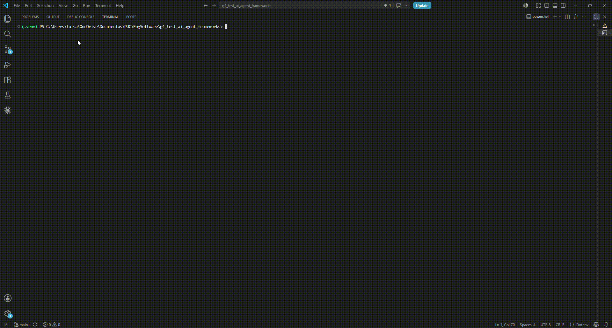

# Agente de Pesquisa e Relatório — Comparativo de Frameworks LLM

Projeto de **benchmark comparativo de frameworks de agentes LLM**, implementando um pipeline canônico idêntico em múltiplos frameworks e medindo métricas objetivas de desempenho.

## Objetivo

Comparar como diferentes frameworks de orquestração de agentes (LangChain, LangGraph, CrewAI, OpenAI Agents SDK) se comportam ao executar o **mesmo pipeline** com os **mesmos prompts**, medindo:

- `api_calls` — número total de tentativas de chamada à API (inclui retries)
- `stage_timings` — latência por etapa (`research_s`, `analysis_s`, `report_s`)
- `token_usage` — consumo de tokens por etapa e total (prompt + completion), capturado da resposta nativa do SDK quando disponível e estimado como fallback
- `transparency_score` — avaliação qualitativa de transparência no planejamento, baseada em sinais observáveis no texto (estrutura, método, premissas, limitações, próximos passos)

A fase atual entrega o **baseline Vanilla**, os protótipos **LangGraph** e **CrewAI** (Sprint 2) e o pipeline **LangChain (LCEL)** com guardrails e engenharia de contexto (Sprint 3).

## Pipeline canônico

```
Tópico → [Pesquisador] → [Analista] → [Redator] → Relatório Executivo
```

| Etapa | Papel       | Objetivo                                              |
|-------|-------------|-------------------------------------------------------|
| 1     | Pesquisador | Coletar fatos, contexto e tendências sobre o tópico   |
| 2     | Analista    | Interpretar dados, riscos, cenários e lacunas         |
| 3     | Redator     | Produzir relatório executivo final                    |

Os prompts compartilhados estão em `common/common/research_prompts.py` e são reutilizados por todos os frameworks.

## Estrutura do repositório

```
g4_test_ai_agent_frameworks/
├── common/                     # Pacote compartilhado (prompts, config, logging, MongoDB)
│   └── common/
│       ├── config.py
│       ├── logging_config.py
│       ├── research_prompts.py
│       └── mongodb/
│           └── research_data.py
├── vanilla/                    # Baseline — API Groq direta (sem framework)
│   └── test_vanilla/
│       ├── config.py
│       ├── research_agent.py
│       └── main.py
├── langchain_pipeline/         # Protótipo Sprint 3 — LangChain (LCEL) + guardrails/contexto
│   └── test_langchain/
│       ├── config.py
│       ├── research_agent.py
│       └── main.py
├── langgraph_pipeline/         # Protótipo Sprint 2 — LangGraph StateGraph
│   └── test_langgraph/
│       ├── config.py
│       ├── research_agent.py
│       └── main.py
├── crewai_pipeline/            # Protótipo Sprint 2 — CrewAI sequencial
│   └── test_crewai/
│       ├── config.py
│       ├── research_agent.py
│       └── main.py
├── docs/
│   ├── CASO_DE_USO.md
│   └── COMO_RODAR.md
├── experiments/
│   └── benchmark_pipelines.py  # Benchmark real que gera métricas e gráficos
├── requirements.txt
├── setup.sh                    # Setup para macOS / Linux
├── setup.ps1                   # Setup para Windows
└── .env.example
```

## Dependências

- Python >= 3.10
- [openai](https://pypi.org/project/openai/) >= 1.40.0
- [python-dotenv](https://pypi.org/project/python-dotenv/) >= 1.0.0
- [pymongo](https://pypi.org/project/pymongo/) >= 4.6.0 *(opcional — persistência)*
- [tenacity](https://pypi.org/project/tenacity/) >= 8.2.0 *(retry automático)*
- [langgraph](https://pypi.org/project/langgraph/) >= 1.0.0
- [langchain-openai](https://pypi.org/project/langchain-openai/) >= 0.3.0
- [crewai](https://pypi.org/project/crewai/) >= 1.0.0
- [Pillow](https://pypi.org/project/Pillow/) >= 10.0.0 *(geração dos gráficos PNG)*

## Instalação

### macOS / Linux

```bash
# 1. Clone o repositório e entre na pasta
git clone <url-do-repo>
cd g4_test_ai_agent_frameworks

# 2. Execute o script de setup
chmod +x setup.sh
./setup.sh

# 3. Ative o ambiente virtual
source .venv/bin/activate

# 4. Configure sua chave de API
cp .env.example .env
# Edite .env e preencha GROQ_API_KEY
```

### Windows (PowerShell)

```powershell
# 1. Clone o repositório e entre na pasta
git clone <url-do-repo>
cd g4_test_ai_agent_frameworks

# 2. Execute o script de setup
.\setup.ps1

# 3. Ative o ambiente virtual
.\.venv\Scripts\activate

# 4. Configure sua chave de API
copy .env.example .env
# Edite .env e preencha GROQ_API_KEY
```

### Instalação manual (qualquer SO)

```bash
python -m venv .venv
source .venv/bin/activate        # Linux/Mac
# ou: .\.venv\Scripts\activate   # Windows

pip install -r requirements.txt
pip install -e ./common -e ./vanilla -e ./langchain_pipeline -e ./langgraph_pipeline -e ./crewai_pipeline
cp .env.example .env
```

## Configuração

Edite o arquivo `.env` gerado:

```dotenv
GROQ_API_KEY=gsk-...            # Obrigatório
GROQ_MODEL=llama-3.3-70b-versatile  # Padrão: llama-3.3-70b-versatile
GROQ_TEMPERATURE=0.0            # Padrão: 0.0
GROQ_BASE_URL=https://api.groq.com/openai/v1
# MONGODB_URI=mongodb://localhost:27017/ # Opcional; descomente para persistir no MongoDB
```

## Execução

```bash
start_vanilla --topic "Impacto da IA na educação brasileira"
start_langchain --topic "Impacto da IA na educação brasileira"
start_langgraph --topic "Impacto da IA na educação brasileira"
start_crewai --topic "Impacto da IA na educação brasileira"
```

## Projeto rodando



O GIF acima mostra o projeto em execução.

## Testes

```bash
python -m unittest discover -s tests
```

## Experimento com gráficos

Além dos comandos individuais dos agentes, o projeto inclui um experimento em
`experiments/benchmark_pipelines.py` para comparar visualmente Vanilla,
LangChain, LangGraph e CrewAI. No modo padrão, ele executa os pipelines reais, coleta as
métricas retornadas por cada implementação e gera tabelas, relatório, dashboard
HTML e gráficos PNG.

```bash
python experiments/benchmark_pipelines.py --runs 1 --topic "Impacto da IA na educação brasileira"
```

Esse comando faz chamadas reais à API configurada no `.env` e consome quota.
Use `--output-dir caminho/da/pasta` para salvar os artefatos em outro local.

O comando gera os artefatos em `artifacts/benchmark/`:

| Arquivo | Descrição |
|---------|-----------|
| `benchmark_dashboard.html` | Dashboard visual com cards, tabela resumida e gráficos incorporados |
| `benchmark_table.md` | Tabela Markdown pronta para anexar ao relatório |
| `benchmark_results.csv` | Dados por execução e linhas de resumo |
| `benchmark_report.md` | Resumo textual do benchmark |
| `benchmark_manifest.json` | Manifesto da execução com parâmetros, frameworks e arquivos gerados |
| `avg_total_time.png` | Gráfico de barras com tempo médio total por framework |
| `avg_stage_time.png` | Gráfico agrupado com médias de pesquisa, análise e relatório |
| `stage_side_by_side.png` | Comparação lado a lado das três etapas por framework |
| `overview_metrics.png` | Painel triplo com velocidade, chamadas de API e tokens médios por framework |

Os gráficos são renderizados com `Pillow`, sem depender de interface gráfica.
O dashboard HTML referencia os PNGs gerados na mesma pasta, então pode ser
aberto diretamente no navegador.

### Saída esperada

```
=== RELATÓRIO FINAL (<framework>) ===

# Relatório Executivo: Impacto da IA na Educação Brasileira

## Resumo Executivo
...

## Introdução
...

[Chamadas API: 3]
[Latência por etapa (s): pesquisa=8.32, análise=6.51, relatório=9.14]
```

## Variáveis de ambiente

| Variável             | Obrigatória | Descrição                         | Padrão                   |
|----------------------|-------------|-----------------------------------|--------------------------|
| `GROQ_API_KEY`       | Sim         | Chave de acesso à API Groq        | —                        |
| `GROQ_MODEL`         | Não         | Modelo a ser utilizado            | `llama-3.3-70b-versatile`|
| `GROQ_TEMPERATURE`   | Não         | Temperatura de geração            | `0.0`                    |
| `GROQ_BASE_URL`      | Não         | Endpoint OpenAI-compatible da Groq | `https://api.groq.com/openai/v1` |
| `MONGODB_URI`        | Não         | URI de conexão MongoDB            | desativado                  |
| `LANGGRAPH_GUARDRAILS` | Não       | Liga/desliga os guardrails no LangGraph | `true`             |
| `LANGGRAPH_CONTEXT_ENGINEERING` | Não | Liga/desliga compactação + notas no LangGraph | `true`    |
| `LANGGRAPH_CONTEXT_MAX_CHARS` | Não  | Orçamento de caracteres da compactação de histórico | `1500`  |
| `LANGGRAPH_NOTES_MAX_POINTS` | Não   | Máximo de pontos por nota estruturada | `6`                 |
| `LANGGRAPH_INPUT_MAX_CHARS` | Não    | Tamanho máximo aceito para o tópico | `2000`                |

## Métricas de benchmark

Cada execução retorna:

```json
{
  "framework": "Vanilla (Groq API) | LangGraph | CrewAI",
  "api_calls": 3,
  "stage_timings": {
    "research_s": 8.32,
    "analysis_s": 6.51,
    "report_s": 9.14,
    "total_s": 23.97
  },
  "token_usage": {
    "prompt_tokens": 1240,
    "completion_tokens": 980,
    "total_tokens": 2220,
    "source": "actual"
  },
  "stage_token_usage": {
    "research": {"prompt_tokens": 420, "completion_tokens": 360, "total_tokens": 780, "source": "actual"},
    "analysis": {"prompt_tokens": 400, "completion_tokens": 310, "total_tokens": 710, "source": "actual"},
    "report":   {"prompt_tokens": 420, "completion_tokens": 310, "total_tokens": 730, "source": "actual"}
  },
  "topic": "...",
  "report": "..."
}
```

Sem retries, o baseline executa três chamadas lógicas. Se houver rate limit, falha de conexão ou erro 5xx transitório, `api_calls` pode ser maior porque contabiliza as tentativas reais enviadas à API.

O campo `source` em `token_usage` indica a origem dos tokens: `actual` quando o SDK expõe metadados reais, `estimated` quando o benchmark caiu no fallback baseado em texto, ou `mixed` quando uma execução combina os dois.

A transparência de planejamento é avaliada por etapa (Pesquisa, Análise, Relatório) com base em sinais observáveis no texto final — estrutura, evidências de método, premissas, limitações e próximos passos — produzindo um score de 0 a 5 e um rótulo (`baixa`, `moderada`, `alta`) consolidado por framework no dashboard e no relatório Markdown.

Esses valores serão usados como **linha de base** para comparação com os demais frameworks.

## Guardrails e engenharia de contexto (LangChain e LangGraph)

Estes recursos são o foco da **Sprint 3** (entregue no pipeline **LangChain**) e
também estão integrados ao **LangGraph**. Os dois consomem os **mesmos módulos
reutilizáveis** do pacote `common` (`guardrails.py` e `context_engineering.py`),
de forma transversal ao fluxo:

- **Guardrails** (`common/common/guardrails.py`)
  - *Entrada*: o nó `input_guard` valida o tópico antes de qualquer chamada de
    API, bloqueando entradas vazias, longas demais, tentativas de prompt
    injection/jailbreak e conteúdo proibido (levanta `GuardrailError`).
  - *Saída*: cada etapa tem o texto higienizado, redigindo segredos (ex.: chaves
    `gsk_…`, `sk-…`, tokens Bearer) que porventura apareçam.
- **Engenharia de contexto** (`common/common/context_engineering.py`)
  - *Compactação de histórico*: condensa o texto repassado entre etapas quando
    excede o orçamento de caracteres, preservando títulos, listas e frases de
    alto sinal.
  - *Notas estruturadas*: memória de trabalho acumulada etapa a etapa, injetada
    nos prompts seguintes em lugar do texto bruto.

Ambos são **determinísticos** (não fazem chamadas extras ao LLM), de modo que
`api_calls` permanece igual ao baseline. Cada execução do LangGraph passa a
expor dois campos adicionais no resultado:

```json
{
  "guardrails": {
    "enabled": true,
    "input": {"allowed": true, "violations": [], "redactions": 0},
    "output_redactions": 0,
    "output_violations": []
  },
  "context_engineering": {
    "enabled": true,
    "notes": {"entries": [{"stage": "pesquisa", "points": ["..."]}], "total_points": 12},
    "compaction": {"analysis_input": {"original_chars": 4200, "compacted_chars": 1500, "ratio": 0.357, "compacted": true}},
    "chars_saved": 2700
  }
}
```

Os recursos podem ser desligados via `LANGGRAPH_GUARDRAILS=false` e
`LANGGRAPH_CONTEXT_ENGINEERING=false` para comparar o comportamento com e sem
essas estratégias.

## Modos avançados opt-in (não afetam o benchmark)

Além do pipeline canônico, LangGraph e CrewAI expõem capacidades que são o
**foco** de cada framework. São desligadas por padrão — o benchmark continua
executando o fluxo sequencial idêntico — e ativadas por flag de CLI.

### LangGraph — estados duráveis (checkpointing + retomada)

Com `--durable`, o estado é persistido a cada nó por um *checkpointer*
(`MemorySaver` por padrão; `SqliteSaver` se houver `--checkpoint-db` e o pacote
`langgraph-checkpoint-sqlite` instalado). Cada execução recebe um `thread_id`,
o que permite **consultar o estado persistido** e **retomar** uma execução
interrompida sem reprocessar etapas já concluídas.

```bash
# Execução durável (gera/usa um thread_id)
start_langgraph --topic "Impacto da IA na educação" --durable --thread-id exec-001

# Retomar a mesma thread após uma interrupção (não refaz etapas concluídas)
start_langgraph --topic "Impacto da IA na educação" --durable --thread-id exec-001 --resume

# Durabilidade entre processos (requer: pip install langgraph-checkpoint-sqlite)
start_langgraph --topic "..." --durable --thread-id exec-001 --checkpoint-db .lg_state.sqlite
```

No modo durável o resultado ganha o campo `durable` (`thread_id`, `checkpointer`,
número de `checkpoints`). Métodos auxiliares: `get_durable_state(thread_id)` e
`state_history(thread_id)`.

### CrewAI — delegação autônoma (processo hierárquico)

Com `--hierarchical`, o crew passa a usar `Process.hierarchical` com um agente
gerente (`manager_llm`) e agentes especializados com `allow_delegation=True` — o
gerente coordena e delega o trabalho de forma autônoma, em vez da esteira fixa.

```bash
# Esteira sequencial (padrão, usada no benchmark)
start_crewai --topic "Impacto da IA na educação"

# Delegação autônoma (gerente coordena os especialistas)
start_crewai --topic "Impacto da IA na educação" --hierarchical
```

No modo hierárquico o resultado ganha o campo `delegation`
(`process`, `allow_delegation`). Observação: o modo hierárquico naturalmente faz
**mais chamadas de API** (coordenação do gerente), por isso é mantido fora do
benchmark comparativo.

## Próximas fases

| Framework           | Status        |
|---------------------|---------------|
| Vanilla (Groq)      | Concluído         |
| LangChain           | Concluído — LCEL + guardrails e engenharia de contexto |
| LangGraph           | Protótipo + guardrails, engenharia de contexto e estados duráveis |
| CrewAI              | Protótipo + modo hierárquico (delegação autônoma) |
| OpenAI Agents SDK   | Planejado         |

## Licença

MIT
