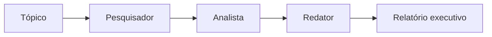

# Caso de uso: Agente de Pesquisa e Relatório

## Objetivo (fase atual)

Implementar o pipeline canônico, o **baseline vanilla** e os protótipos mínimos de Sprint 2 em **LangGraph** e **CrewAI**.

## Fluxo canônico



## Baseline (Vanilla)

- Sem dependências de orquestração
- Três chamadas lógicas explícitas: `client.chat.completions.create`
- `api_calls = 3` sem retries; pode aumentar se houver tentativas automáticas em erros transitórios
- `stage_timings`: `research_s`, `analysis_s`, `report_s`, `total_s`

Implementação: `vanilla/test_vanilla/research_agent.py`

## Protótipos Sprint 2

| Framework | Implementação | Foco |
|-----------|---------------|------|
| LangGraph | `langgraph_pipeline/test_langgraph/research_agent.py` | Controle explícito do fluxo com `StateGraph` + guardrails e engenharia de contexto |
| CrewAI | `crewai_pipeline/test_crewai/research_agent.py` | Colaboração sequencial entre agentes especializados |

## Guardrails e engenharia de contexto (LangGraph)

O pipeline LangGraph integra, de forma transversal, módulos reutilizáveis do
pacote `common`:

- **Guardrails** (`common/common/guardrails.py`)
  - *Entrada* (nó `input_guard`): rejeita tópicos vazios, longos demais,
    tentativas de prompt injection/jailbreak e conteúdo proibido **antes** de
    gastar chamadas de API. Em caso de bloqueio, levanta `GuardrailError`.
  - *Saída*: higieniza o texto de **cada etapa**, redigindo segredos (chaves de
    API, tokens) que porventura vazem.
- **Engenharia de contexto** (`common/common/context_engineering.py`)
  - *Compactação de histórico*: quando o texto de uma etapa excede um orçamento
    de caracteres, é condensado mantendo títulos, listas e frases de alto sinal
    antes de ser repassado adiante.
  - *Notas estruturadas*: memória de trabalho acumulada etapa a etapa e injetada
    nos prompts seguintes em lugar do texto bruto.

Ambos são **determinísticos** (sem chamadas extras ao LLM), preservando o
contrato `api_calls == 3` do benchmark. Os recursos podem ser desligados por
variáveis de ambiente (`LANGGRAPH_GUARDRAILS`, `LANGGRAPH_CONTEXT_ENGINEERING`).
O resultado passa a expor os campos `guardrails` e `context_engineering` com as
métricas correspondentes.

Comandos:

```bash
start_vanilla --topic "Impacto da IA na educação brasileira"
start_langgraph --topic "Impacto da IA na educação brasileira"
start_crewai --topic "Impacto da IA na educação brasileira"
```

## Variáveis controladas

| Variável    | Fonte                                                                   |
|-------------|-------------------------------------------------------------------------|
| Prompts     | `common/common/research_prompts.py` (`*_system` + `*_user` por etapa)  |
| Modelo      | `GROQ_MODEL`                                                            |
| Temperatura | `GROQ_TEMPERATURE`                                                      |
| Tópico      | `--topic` na CLI                                                        |

## Próximas fases

Evoluir a comparação com OpenAI Agents SDK, guardrails, engenharia de contexto e consolidação das métricas de latência, tokens e custo.
